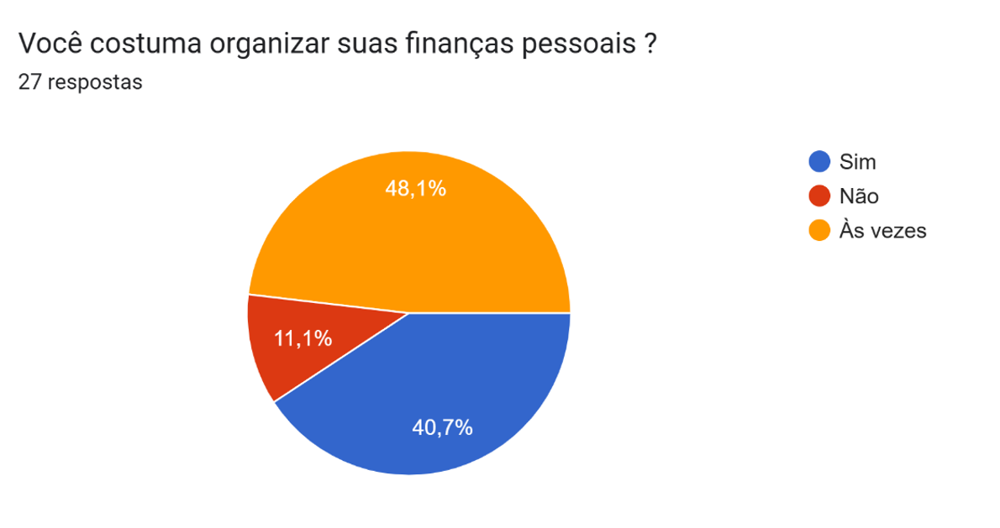
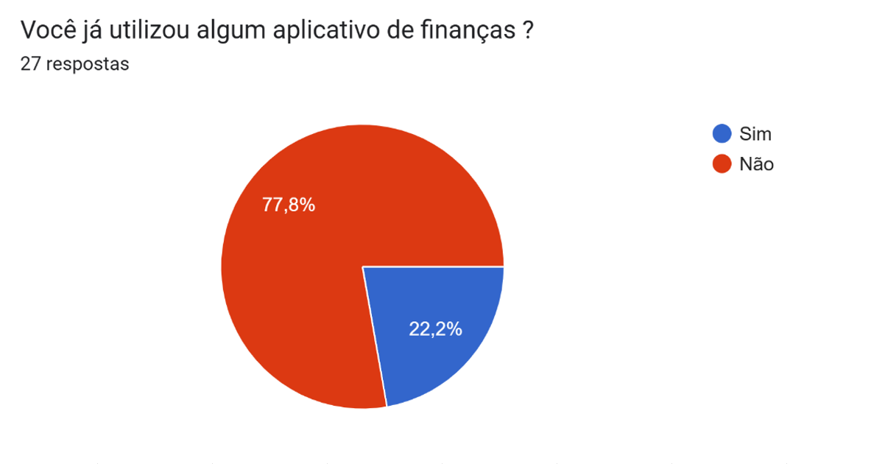
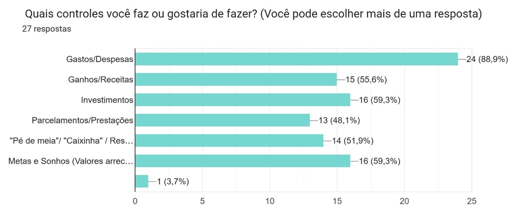
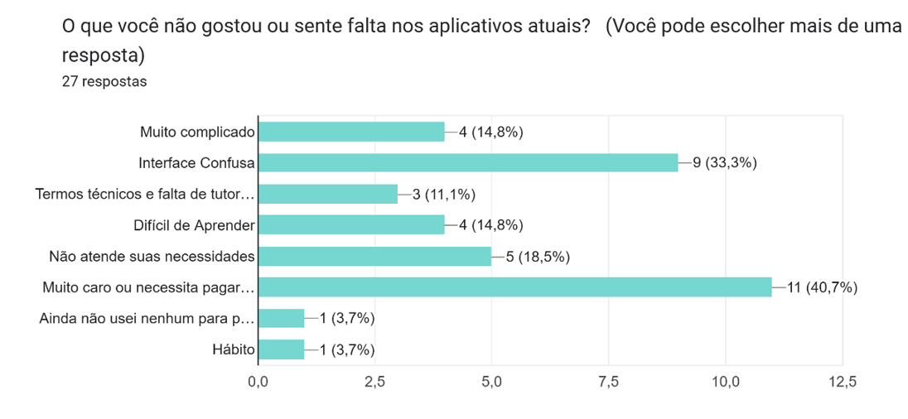
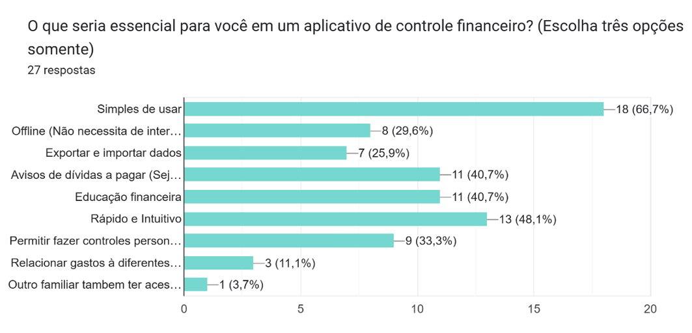
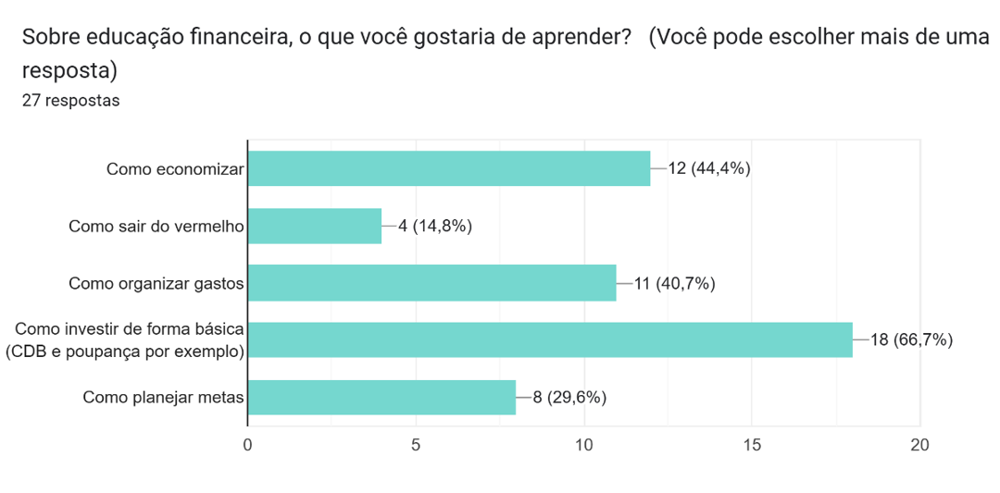
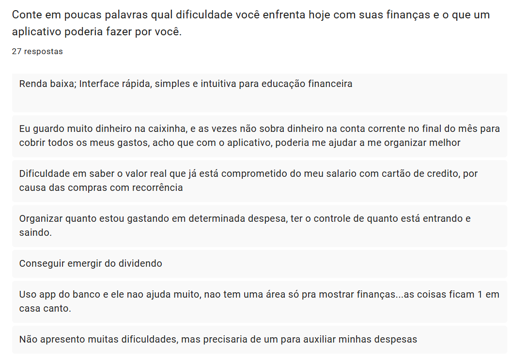

# 🔍 Survey Analysis - Análise da Pesquisa

- [Survey Analysis (EN)](#survey-analysis-en)
    ---
    - [Description](#description)
    - [Field Research](#field-research)
    - [Results and Data](#results-and-data)
        - [Question 01 - "Do you usually organize your personal finances ?"](#question-01---do-you-usually-organize-your-personal-finances-)
        - [Question 02 - "Have you ever used a finance app ?"](#question-02---have-you-ever-used-a-finance-app-)
        - [Question 03 - "Which controls do you use or would like to use ? (Multiple choice)"](#question-03---which-controls-do-you-use-or-would-like-to-use--multiple-choice)
        - [Question 04 - "What do you dislike or miss in current apps ? (Multiple choice)"](#question-04---what-do-you-dislike-or-miss-in-current-apps--multiple-choice)
        - [Question 05 - "What is essential in a financial control app ? (Up to 3 choices)"](#question-05---what-is-essential-in-a-financial-control-app--up-to-3-choices)
        - [Question 06 - "Regarding financial education, what would you like to learn ? (Multiple Choice)"](#question-06---regarding-financial-education-what-would-you-like-to-learn--multiple-choice)
        - [Question 07 - "Open-ended question"](#question-07---open-ended-question)
    - [Conclusion](#conclusion)

- [Análise da Pesquisa (PT-BR)](#análise-da-pesquisa-pt-br)
    ---
    - [Descrição](#descrição)
    - [Pesquisa de Campo](#pesquisa-de-campo)
    - [Resultados e Dados](#resultados-e-dados)
        - [Questão 01 - "Você costuma organizar suas finanças pessoais ?"](#questão-01---você-costuma-organizar-suas-finanças-pessoais-)
        - [Questão 02 - "Você já utilizou algum aplicativo de finanças ?"](#questão-02---você-já-utilizou-algum-aplicativo-de-finanças-)
        - [Questão 03 - "Quais controles você faz ou gostaria de fazer? (Múltipla Escolha)"](#questão-03---quais-controles-você-faz-ou-gostaria-de-fazer-múltipla-escolha)
        - [Questão 04 - "O que você não gostou ou sente falta nos aplicativos atuais? (Múltipla Escolha)"](#questão-04---o-que-você-não-gostou-ou-sente-falta-nos-aplicativos-atuais-múltipla-escolha)
        - [Questão 05 - "O que seria essencial para você em um aplicativo de controle financeiro? (Múltipla Escolha - Até 03)"](#questão-05---o-que-seria-essencial-para-você-em-um-aplicativo-de-controle-financeiro-múltipla-escolha---até-03)
        - [Questão 06 - "Sobre educação financeira, o que você gostaria de aprender? (Múltipla Escolha)"](#questão-06---sobre-educação-financeira-o-que-você-gostaria-de-aprender-múltipla-escolha)
        - [Questão 07 - "Conte em poucas palavras qual dificuldade você enfrenta hoje com suas finanças e o que um aplicativo poderia fazer por você. (Dissertativa)"](#questão-07---conte-em-poucas-palavras-qual-dificuldade-você-enfrenta-hoje-com-suas-finanças-e-o-que-um-aplicativo-poderia-fazer-por-você-dissertativa)
    - [Conclusão](#conclusão)

## Survey Analysis (EN)

### Description
The purpose of this field survey analysis is to identify users’ real needs and generally validate the most important aspects at this stage. It aims to confirm what truly matters for the next steps of the software requirements analysis.

### Field Research
The survey was conducted from December 12, 2025, to December 31, 2026, with a total of 27 responses. The questionnaire consisted of 7 questions:

- 2 multiple-choice (single answer),
- 4 multiple-choice (multiple answers),
- 1 open-ended question.

The questions aimed to understand participants’ realities, their familiarity with personal finance applications, their difficulties, and the features they consider essential.

### Results and Data

Below are the results for each question.

#### Question 01 - "Do you usually organize your personal finances ?"

    Pie chart showing the percentage results related to the 27 responses to question 01.

- "Yes": 11,
- "Sometimes": 13,
- "No": 3.

#### Question 02 - "Have you ever used a finance app ?"

    Pie chart showing the percentage results related to the 27 responses to question 02.
 
- "Yes": 6,
- "No": 21.

#### Question 03 - "Which controls do you use or would like to use ? (Multiple choice)"

    Bar chart showing the results as percentages and values ​​related to each available choice in question 3.

- "Expenses": 24,
- "Income": 15,
- "Investments": 16,
- "Installments": 13,
- "Savings/Reserve": 14,
- "Goals and dreams": 16,
- "Other (Counting)": 1.

#### Question 04 - "What do you dislike or miss in current apps ? (Multiple choice)"

    Bar chart showing the results as percentages and values ​​related to each available choice in question 4.
 
- "Too complicated": 4,
- "Confusing interface": 9,
- "Technical terms and lack of tutorials": 3,
- "Difficult to learn": 4,
- "Does not meet needs": 5,
- "Too expensive": 11,
- "Other": 2.

#### Question 05 - "What is essential in a financial control app ? (Up to 3 choices)"

    Bar chart showing the results as percentages and values ​​related to each available choice in question 5.

- "Easy to use": 18,
- "Offline mode": 8,
- "Import/export data": 7,
- "Financial education": 11,
- "Fast and intuitive": 13,
- "Custom controls": 9,
- "Multiple accounts": 3,
- "Family access": 1.

#### Question 06 - "Regarding financial education, what would you like to learn ? (Multiple Choice)"

    Bar chart showing the results as percentages and values ​​related to each available choice in question 6.
 
- "How to save money": 12,
- "How to get out of debt": 4,
- "How to organize expenses": 11,
- "Basic investments": 18,
- "Goal planning": 8.

#### Question 07 - "Open-ended question"

    Input and responses from participants for question 7.
 
Participants reported difficulties related to financial organization, expense control, lack of planning, and the absence of simple and accessible tools.

### Conclusion
Based on the results, most participants have little experience with financial management applications. Many report difficulties due to complexity, high costs, and technical language.

As a result, they often rely on informal methods such as paper notes, spreadsheets, or memory, which increases the risk of errors and weakens financial control.

Furthermore, there is strong interest in financial education, especially in learning how to organize expenses, plan ahead, save money, and invest. This highlights the need for a simple, affordable, intuitive, and educational solution.

## Análise da Pesquisa (PT-BR)

### Descrição
A análise da pesquisa de campo tem como objetivo identificar as reais necessidades das pessoas e validar, de forma geral, os principais aspectos considerados importantes no momento. Dessa forma, busca-se confirmar o que realmente importa para as próximas etapas do levantamento de requisitos de *software*.

### Pesquisa de Campo
A pesquisa teve início em 12 de dezembro de 2025 e encerramento em 31 de dezembro de 2026, totalizando 27 respostas. O questionário foi composto por 7 perguntas, sendo:

- 2 de alternativas,
- 4 de múltipla escolha,
- 1 dissertativa.

Essas questões buscaram compreender a realidade dos participantes, sua familiaridade com aplicativos de controle financeiro, suas dificuldades e quais recursos consideram essenciais.

### Resultados e Dados

A seguir, são apresentados os resultados obtidos em cada questão.

#### Questão 01 - "Você costuma organizar suas finanças pessoais ?"

    Gráfico de setores com os resultados em porcentagem relacionado as 27 respostas da questão 01.
 
Das 27 pessoas que responderam:
- 11 responderam "Sim",
- 13 responderam "Às Vezes",
- 3 responderam "Não".

#### Questão 02 - "Você já utilizou algum aplicativo de finanças ?"

    Gráfico de setores com os resultados em porcentagem relacionado as 27 respostas da questão 02.
 
Das 27 pessoas que responderam:
- 6 responderam "Sim",
- 21 responderam "Não".

#### Questão 03 - "Quais controles você faz ou gostaria de fazer? (Múltipla Escolha)"

    Gráfico de barras com os resultados em porcentagem e valores relacionados a cada escolha disponível da questão 03.
 
Das 27 pessoas que responderam:
- 24 responderam "Gastos/Despesas",
- 15 responderam "Ganhos/Receitas",
- 16 responderam "Investimentos",
- 13 responderam "Parcelamentos/Prestações",
- 14 responderam "*Pé de meia* / *Caixinha* / Reserva",
- 16 responderam "Metas e Sonhos (Valores arrecadados ou guardados para um propósito)",
- 1 respondeu "Outra: *Contagem*".

#### Questão 04 - "O que você não gostou ou sente falta nos aplicativos atuais? (Múltipla Escolha)"

    Gráfico de barras com os resultados em porcentagem e valores relacionados a cada escolha disponível da questão 4.
 
Das 27 pessoas que responderam:
- 4 responderam "Muito Complicado",
- 9 responderam "Interface Confusa",
- 3 responderam "Termos técnicos e falta de tutorias",
- 4 responderam "Difícil de Aprender",
- 5 responderam "Não atende suas necessidades",
- 11 responderam "Muito caro ou necessita pagar qualquer tipo de licença para uso",
- 1 respondeu "Outra: *Ainda não usei nenhum para poder comparar*",
- 1 respondeu "Outra: *Hábito*".

#### Questão 05 - "O que seria essencial para você em um aplicativo de controle financeiro? (Múltipla Escolha - Até 03)"

    Gráfico de barras com os resultados em porcentagem e valores relacionados a cada escolha disponível da questão 5.
 
Das 27 pessoas que responderam:
- 18 responderam "Simples de usar",
- 8 responderam "Offline (Não necessita de internet para uso)",
- 7 responderam "Exportar e importar dados",
- 11 responderam "Educação financeira",
- 11 responderam "Não atende suas necessidades",
- 13 responderam "Rápido e Intuitivo",
- 9 responderam "Permitir fazer controles personalizados (Agrupar váridas dívidas, por exemplo: *Gastos com mercado* = *Arroz*, *Feijão*, *Carne*)",
- 3 responderam "Relacionar gastos à diferentes contas (Conseguir registrar diversas contas e vincular gastos apenas para aquela conta ou *armazenamento de renda*)",
- 1 respondeu "Outra: *Outro familiar tambem ter acesso simultaneamente*".

#### Questão 06 - "Sobre educação financeira, o que você gostaria de aprender? (Múltipla Escolha)"

    Gráfico de barras com os resultados em porcentagem e valores relacionados a cada escolha disponível da questão 6.
 
Das 27 pessoas que responderam:
- 12 responderam "Como Economizar",
- 4 responderam "Como sair do Vermelho",
- 11 responderam "Como organizar gastos",
- 18 responderam "Como investir de forma básica
(CDB e poupança por exemplo)",
- 8 responderam "Como planejar metas".

#### Questão 07 - "Conte em poucas palavras qual dificuldade você enfrenta hoje com suas finanças e o que um aplicativo poderia fazer por você. (Dissertativa)"

    Campo e respostas dos participantes da questão 7.
 
Os participantes relataram dificuldades relacionadas à organização financeira, controle de gastos, falta de planejamento e ausência de ferramentas simples e acessíveis.

### Conclusão
Com base nos resultados, observa-se que a maioria dos participantes possui pouco contato com aplicativos financeiros. Muitos relatam dificuldades devido à complexidade, custo elevado e linguagem técnica dessas ferramentas.

Como consequência, optam por métodos informais, como anotações em papel, planilhas ou memória, o que favorece erros e dificulta o controle financeiro.

Além disso, há grande interesse em educação financeira, especialmente em aprender a organizar gastos, planejar o futuro, economizar e investir. Isso demonstra a necessidade de uma solução simples, acessível, intuitiva e educativa.